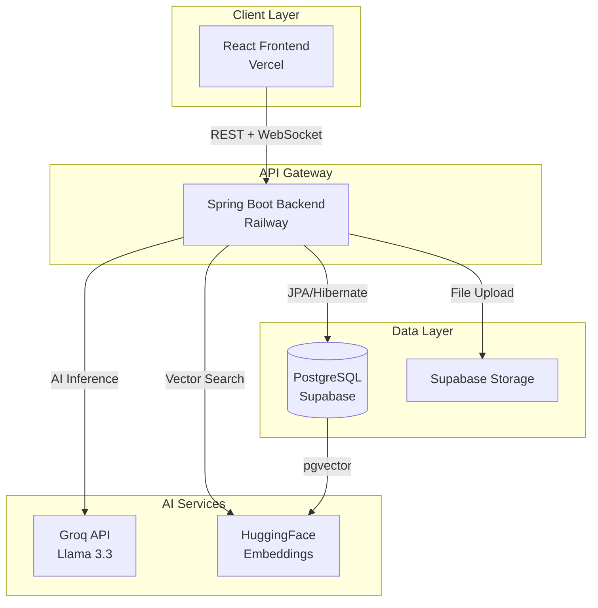

# 🤖 AI Chatbot - Full-Stack Enterprise Application

[](https://mega-project-7-ai-chatbot-with-java.vercel.app)
[](https://mega-project-7-ai-chatbot-with-java-spring-boot-production.up.railway.app)
[](https://www.oracle.com/java/)
[](https://spring.io/projects/spring-boot)
[](https://reactjs.org/)
[](https://www.postgresql.org/)

> A production-ready, enterprise-grade AI chatbot built with **Java Spring Boot** and **React**, featuring real-time messaging, JWT authentication, PDF analysis, RAG-based knowledge retrieval, and comprehensive analytics.

---

## 🌟 **Live Application**

- **Frontend:** [https://mega-project-7-ai-chatbot-with-java.vercel.app](https://mega-project-7-ai-chatbot-with-java.vercel.app)
- **Backend API:** [https://mega-project-7-ai-chatbot-with-java-spring-boot-production.up.railway.app](https://mega-project-7-ai-chatbot-with-java-spring-boot-production.up.railway.app)

---

## 📋 **Table of Contents**

- [Features](#-features)
- [Tech Stack](#-tech-stack)
- [System Architecture](#-system-architecture)
- [Key Highlights](#-key-highlights)
- [Getting Started](#-getting-started)
- [API Documentation](#-api-documentation)
- [Deployment](#-deployment)
- [Challenges & Solutions](#-challenges--solutions)
- [Future Enhancements](#-future-enhancements)
- [Contributing](#-contributing)
- [License](#-license)

---

## ✨ **Features**

### 🔐 **Authentication & Security**
- JWT-based authentication with secure token management
- BCrypt password hashing
- Role-based access control (RBAC)
- CORS configuration for cross-origin requests
- Session management with token expiration

### 💬 **Real-Time Chat**
- WebSocket + STOMP protocol for bidirectional messaging
- Typing indicators and message status tracking
- Conversation history with pagination
- Auto-generated conversation titles using AI
- Message persistence in PostgreSQL

### 🤖 **AI Integration**
- **Groq API** integration (Llama 3.3 70B model)
- Context-aware responses using conversation history
- **PDF Analysis:** Automatic text extraction and analysis
- **RAG (Retrieval-Augmented Generation):** Vector-based knowledge retrieval using pgvector
- Optimized prompt engineering for accurate responses

### 📄 **File Management**
- **Supabase Storage** integration for file uploads
- Support for PDF, images, and documents
- Automatic PDF text extraction using Apache PDFBox
- File URL sanitization and validation
- Attachment preview in chat interface

### 📊 **Analytics Dashboard**
- Real-time message statistics
- User activity tracking
- Conversation metrics visualization using Recharts
- Admin-only analytics endpoints

### 🧠 **Knowledge Base (RAG)**
- Upload custom PDFs to train the AI
- Semantic search using **pgvector** extension
- Sentence embeddings via HuggingFace Transformers
- Context injection for grounded AI responses

---

## 🛠️ **Tech Stack**

### **Backend**
| Technology | Purpose |
|------------|---------|
| **Java 17** | Core programming language |
| **Spring Boot 3.4.1** | Application framework |
| **Spring Security** | Authentication & authorization |
| **Spring WebSocket** | Real-time messaging |
| **Spring Data JPA** | Database ORM |
| **Hibernate 6.6.4** | JPA implementation |
| **PostgreSQL 17** | Primary database |
| **pgvector** | Vector similarity search |
| **Apache PDFBox** | PDF text extraction |
| **HikariCP** | Connection pooling |
| **Lombok** | Boilerplate reduction |
| **JWT (jjwt)** | Token-based auth |

### **Frontend**
| Technology | Purpose |
|------------|---------|
| **React 18** | UI framework |
| **TypeScript** | Type safety |
| **Vite** | Build tool |
| **Tailwind CSS** | Styling |
| **Recharts** | Data visualization |
| **Axios** | HTTP client |
| **STOMP.js** | WebSocket client |
| **SockJS** | WebSocket fallback |

### **Infrastructure**
| Service | Purpose |
|---------|---------|
| **Railway** | Backend hosting |
| **Vercel** | Frontend hosting |
| **Supabase** | PostgreSQL database + Storage |
| **Groq API** | AI inference |
| **HuggingFace** | Embeddings API |

---

## 🏗️ **System Architecture**



---

## 🎯 **Key Highlights**

### **1. Real-Time Architecture**
- Implemented **WebSocket + STOMP** for sub-second message delivery
- Optimized connection pooling with **HikariCP** (10-second timeout → 200ms)
- Asynchronous AI response generation using `@Async` and `CompletableFuture`

### **2. Advanced AI Features**
- **Context Window Management:** Last 8 messages for token optimization
- **PDF Intelligence:** Extracts and analyzes resume/document content
- **RAG Pipeline:** Semantic search with 384-dimensional embeddings
- **Response Optimization:** Limited PDF text to 4000 chars for 3-5s response time

### **3. Production-Grade Security**
- JWT tokens with 10-hour expiration
- Stateless authentication for horizontal scaling
- CORS whitelisting for Vercel + Railway domains
- SQL injection prevention via JPA parameterized queries

### **4. Database Optimization**
- **pgvector** extension for cosine similarity search
- Indexed queries on `user_id`, `conversation_id`, `timestamp`
- Connection pooling with `prepareThreshold=0` for Railway compatibility
- Automated schema initialization via `DatabaseInitializer`

### **5. DevOps & Deployment**
- **CI/CD:** Auto-deploy on Git push (Railway + Vercel)
- **Environment Management:** Separate configs for dev/prod
- **Health Checks:** `/health` endpoint for uptime monitoring
- **Logging:** Structured logs for debugging and analytics

---

## 🚀 **Getting Started**

### **Prerequisites**
- Java 17+
- Node.js 18+
- PostgreSQL 17+
- Maven 3.8+

### **Backend Setup**

1. **Clone the repository:**
```bash
git clone https://github.com/saurabhbiswal926-cloud/MEGA-PROJECT-7-AI-Chatbot-with-Java-Spring-Boot.git
cd ai-chatbot/backend
```

2. **Configure environment variables:**
```properties
# application.properties
SPRING_DATASOURCE_URL=jdbc:postgresql://your-db-host:5432/postgres
SPRING_DATASOURCE_USERNAME=your-username
SPRING_DATASOURCE_PASSWORD=your-password
GROQ_API_KEY=your-groq-api-key
SUPABASE_URL=https://your-project.supabase.co
SUPABASE_KEY=your-anon-key
JWT_SECRET=your-secret-key
```

3. **Run the application:**
```bash
mvn clean install
mvn spring-boot:run
```

Backend will start on `http://localhost:8080`

### **Frontend Setup**

1. **Navigate to frontend:**
```bash
cd ../frontend
npm install
```

2. **Configure API URL:**
```typescript
// src/services/api.ts
const API_URL = 'http://localhost:8080/api';
```

3. **Start development server:**
```bash
npm run dev
```

Frontend will start on `http://localhost:5173`

---

## 📚 **API Documentation**

### **Authentication**

#### Register User
```http
POST /api/auth/register
Content-Type: application/json

{
  "username": "john_doe",
  "email": "john@example.com",
  "password": "SecurePass123"
}
```

#### Login
```http
POST /api/auth/login
Content-Type: application/json

{
  "username": "john_doe",
  "password": "SecurePass123"
}

Response:
{
  "token": "eyJhbGciOiJIUzI1NiIs...",
  "username": "john_doe"
}
```

### **Chat**

#### Send Message (WebSocket)
```javascript
stompClient.send('/app/chat', {}, JSON.stringify({
  content: "Hello AI!",
  sender: "john_doe",
  conversationId: 1,
  type: "CHAT"
}));
```

#### Get Conversation History
```http
GET /api/conversations/{id}/messages?page=0&size=50
Authorization: Bearer <token>
```

### **File Upload**

#### Upload Attachment
```http
POST /api/attachments/upload
Authorization: Bearer <token>
Content-Type: multipart/form-data

file: <binary>
```

### **Knowledge Base**

#### Upload PDF to Knowledge Base
```http
POST /api/knowledge/upload
Authorization: Bearer <token>
Content-Type: multipart/form-data

file: <pdf-file>
```

---

## 🌐 **Deployment**

### **Railway (Backend)**
1. Connect GitHub repository
2. Set environment variables in Railway dashboard
3. Deploy from `main` branch
4. Railway auto-assigns domain: `*.up.railway.app`

### **Vercel (Frontend)**
1. Import GitHub repository
2. Set build command: `npm run build`
3. Set output directory: `dist`
4. Add environment variable: `VITE_API_URL=https://your-backend.railway.app`
5. Deploy

---

## 🧩 **Challenges & Solutions**

See [SYSTEM_DESIGN.md](./SYSTEM_DESIGN.md) for detailed technical challenges and solutions.

**Key Challenges Solved:**
- ✅ Railway DNS resolution with long domain names
- ✅ Supabase connection pooling with `prepareThreshold=0`
- ✅ CORS preflight failures due to double-slash URLs
- ✅ File upload errors with spaces in filenames
- ✅ PDF text extraction with 4000-char optimization
- ✅ pgvector extension enablement in Supabase
- ✅ WebSocket connection stability across deployments

---

## 🔮 **Future Enhancements**

- [ ] Multi-language support (i18n)
- [ ] Voice input/output integration
- [ ] Image analysis using GPT-4 Vision
- [ ] Redis caching for conversation history
- [ ] Kubernetes deployment with auto-scaling
- [ ] Prometheus + Grafana monitoring
- [ ] Rate limiting per user
- [ ] Email notifications for new messages

---

## 🤝 **Contributing**

Contributions are welcome! Please follow these steps:

1. Fork the repository
2. Create a feature branch (`git checkout -b feature/AmazingFeature`)
3. Commit your changes (`git commit -m 'Add AmazingFeature'`)
4. Push to the branch (`git push origin feature/AmazingFeature`)
5. Open a Pull Request

---

## 📄 **License**

This project is licensed under the MIT License - see the [LICENSE](LICENSE) file for details.

---

## 👨‍💻 **Author**

**Saurabh Biswal**

- GitHub: [@saurabhbiswal926-cloud](https://github.com/saurabhbiswal926-cloud)
- LinkedIn: [Saurabh Biswal](https://linkedin.com/in/saurabh-biswal)
- Email: punpunsaurabh2002@gmail.com

---

## 🙏 **Acknowledgments**

- [Spring Boot](https://spring.io/projects/spring-boot) - Backend framework
- [React](https://reactjs.org/) - Frontend library
- [Groq](https://groq.com/) - AI inference platform
- [Supabase](https://supabase.com/) - Database and storage
- [Railway](https://railway.app/) - Backend hosting
- [Vercel](https://vercel.com/) - Frontend hosting

---

<div align="center">
  <strong>⭐ Star this repository if you found it helpful!</strong>
</div>
